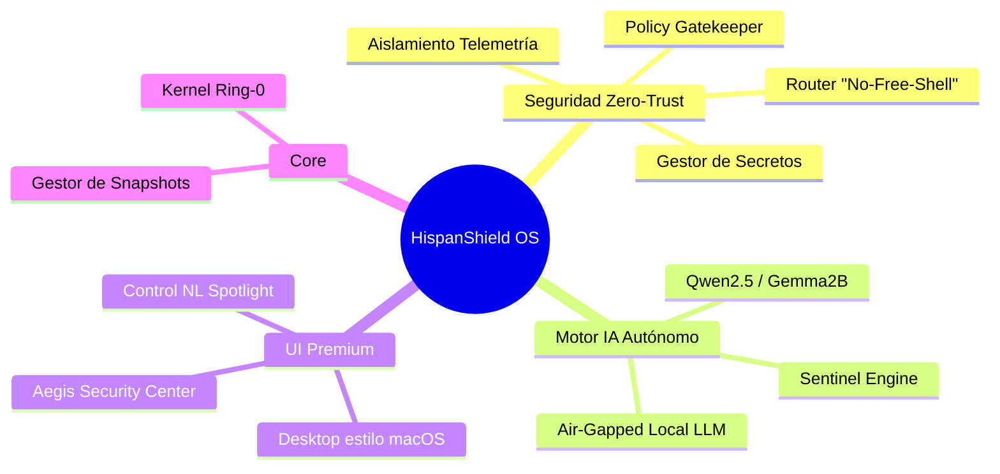
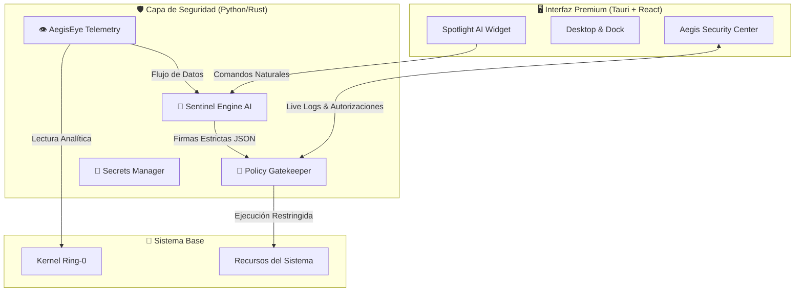
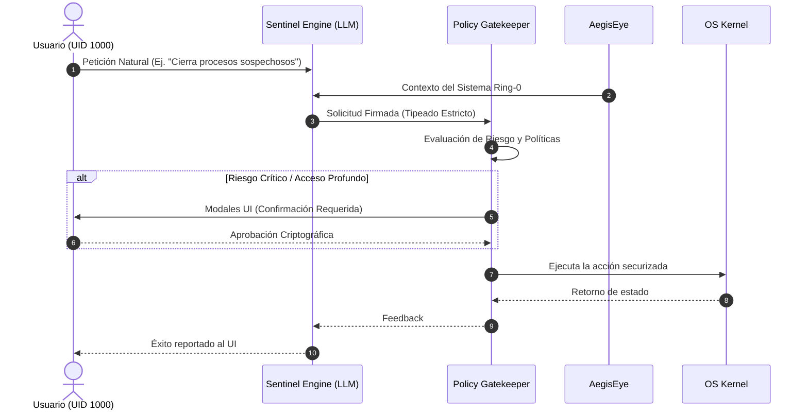

<p align="center">
  
  
  
  
</p>

# 🛡️ HispanShield OS LLmSecurity

**HispanShield OS LLmSecurity** es un sistema operativo premium basado en Linux, diseñado desde cero con una mentalidad **Zero-Trust** y orquestado localmente por inteligencia artificial autónoma (modelos nativos *LLM* integrados en el sistema).

Diseñado con una estética *macOS-inspired* fluida, este sistema reemplaza los frágiles *scripts* tradicionales y la supervisión humana intensiva por un **Agente Inteligente Sentinel** vigilante, residente en las capas más profundas el núcleo del sistema operativo.

---

## 🧠 Mapa Mental de Características



---

## 🔒 Mecanismos "Zero-Trust" y de Seguridad

El núcleo de **HispanShield** se estructura alrededor de 4 pilares inquebrantables de seguridad:

1. **🛡️ Aislamiento de Telemetría (*AegisEye*)**: El observador lee métricas directamente en modo `ring-0` (Kernel) en tiempo real. Esto elimina el envenenamiento de estado mediante ejecución maliciosa. El agente siente y monitoriza el pulso real de la máquina.
2. **🧠 Motor LLM Local (*Qwen2.5-1.5B/Gemma2B*)**: Integrado de fábrica. Ofrece capacidades generativas ricas con apenas ~1GB de consumo de RAM y funciona bajo **aislamiento total de red local (Air-gapped)**, imposibilitando cualquier posible fuga de información (Exfiltration).
3. **🚫 Restricción "No-Free-Shell"**: HispanShield carece intencionalmente de la clásica e insegura terminal accesible a la IA general. El motor LLM jamás ejecuta instrucciones directas de `bash`. Cada acción es enrutada mediante firmas estrictamente tipadas.
4. **🛑 Guardián de Políticas (*Policy Engine Gatekeeper*)**: Todo intento de cambio de sistema es denegado por defecto. Acciones drásticas a nivel de *kernel* o archivos invocan alertas interactivas a través de *Aegis Security Center*, forzando confirmación matemática e interactiva por el dueño (UID 1000).

---

## ⚙️ Arquitectura del Sistema



---

## 🛡️ Flujo de Aprobación de Acciones (Gatekeeper)

A continuación se expone cómo el **Policy Gatekeeper** intercepta acciones potencialmente peligrosas derivadas de peticiones de usuario:



---

## 🖥️ Experiencia Premium (UI)

La interacción hacia *HispanShield OS* no recae en oscuras CLI, sino en una plataforma de tecnología web compilada como binarios nativos (**Tauri + React/Vite**).

- **🌌 Escritorio, Dock y Barra Superior**: Animaciones cinéticas suaves (`framer-motion`), diseño Glassmorphism impulsado con librerías modernas como Tailwind CSS y temas dinámicos de OS.
- **🛡️ Aegis Security Center**: Exquisito panel forense de auditoría que lista el log interactivo minuto a minuto: rastrea cada acción y autorización mediada por el *Sentinel Engine*.
- **🔎 Spotlight del Agente (Widget Inteligente)**: Barra desplegable global, siempre atenta, lista para interceptar intenciones naturales (NL) de configuración o protección.

---

## 💿 Instalación y Despliegue

Existen dos vías recomendadas y securizadas de implantación:

### 1️⃣ Método 1: Bare-Metal (Instalación ISO Nativa)
Ruta principal para la máxima seguridad por hardware.
1. Compila o descarga el paquete ISO `HispanShieldOS-LLmSecurity-Release1.iso` *(Usa los scripts provistos en Debian/Ubuntu como `build_iso.sh`)*.
2. Formatea el pendrive / medio extraíble *(mín. 8 GB)* usando utilidades confiables (Rufus, BalenaEtcher).
3. Arranca con prioridad USB desde la BIOS/UEFI.
4. **Verificación Póstuma**: HispanShield verificará hashes precalculados internamente. El LLM se descargará solo tras un Handshake certificado mediante llave SHA256.

### 2️⃣ Método 2: Subsistema Inyectado (Servidor Linux Huésped)
Si deseas implementar las protecciones de *HispanShield* sobre distros base (Preferente Debian 12):
1. Clona o mueve este repositorio a entornos locales seguros (Ej: `~/hispanshieldos/`).
2. Inicializa las políticas de aislamiento e inyección del núcleo:
   ```bash
   sudo ./installer/install.sh
   ```
3. El instalador segmentará dependencias, atará *sub-usuarios* cautivos y creará los *sockets IPC* unix requeridos. Al culminar, la *UI* de escritorio estará disponible para empoderar al SO.
