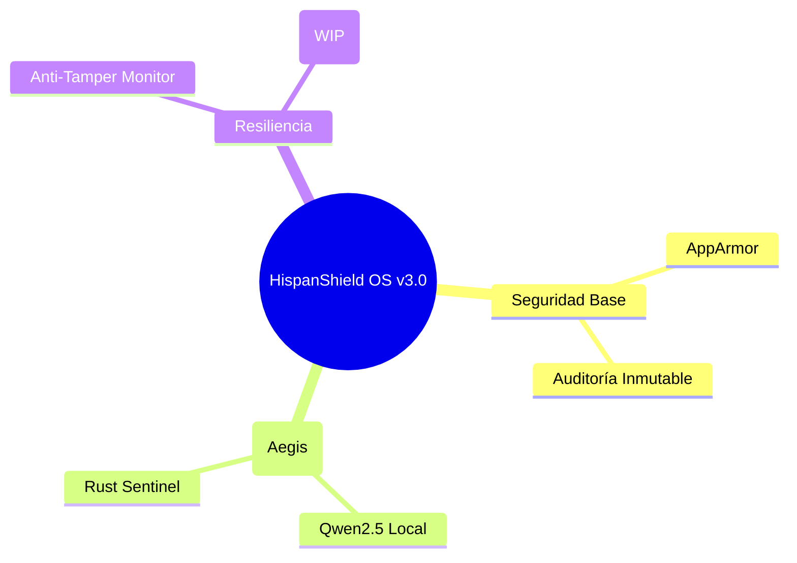

# 🛡️ HispanShield OS v3.0 (PoC / Research)
**SISTEMA OPERATIVO DE SEGURIDAD (CONCEPTO)**

> **ESTADO**: Prueba de Concepto (PoC) / Investigación
> **USO**: Entornos de prueba y análisis de seguridad. No apto para producción.


---

## 👁️ VISIÓN ESTRATÉGICA
HispanShield OS v3.0 representa la cumbre de la ingeniería de software aplicada al campo militar. Diseñado para operar en escenarios de **Cyber Warfare Tier-1**, este sistema integra IA Soberana (Air-Gapped), arquitectura de confianza cero (*Zero-Trust*), y armamento cibernético avanzado (CNE).

### 🎬 Secuencia de Arranque (Boot)
El sistema inicializa sus módulos criptográficos y de IA en un entorno estrictamente aislado.


### 🔐 Autenticación Sentinel
El acceso requiere MFA por hardware obligatorio. No existen contraseñas convencionales en HispanShield OS.


---

### 1. 🛡️ Arquitectura Zero-Trust Base
*   **AppArmor Profiles**: Restricción de procesos clave (LLM Runtime, Sentinel).
*   **Auditoría Inmutable**: Reglas de `auditd` para evitar borrado de logs y garantizar trazabilidad.
*   **Integridad de Ejecución**: Base para futuras integraciones de `MLS` en Rust y firmas digitales de componentes.

### 2. 🔥 Resiliencia y Control
Preparado para análisis de seguridad:
*   **Módulo Anti-Tamper**: Detección de manipulaciones con autodestrucción simulada para análisis de mitigación de ataques físicos.
*   **Aislamiento**: Diseño enfocado en la separación de componentes críticos mediante Rust y políticas de sistema estrictas.
---

## 🗺️ MAPA MENTAL DE LA ARQUITECTURA



---

## 🛠️ INSTRUCCIONES DE DESPLIEGUE (OPERADORES TÁCTICOS)

### 1. Construcción de la Imagen ISO (Requiere Entorno Limpio Debian/WSL2)
La compilación requiere dependencias de sistema y Rust nativo.

```bash
# 1. Clona el repositorio en entorno seguro
git clone <REPOSITORIO_CLASIFICADO> /opt/HispanShieldOsLLmSecurity
cd /opt/HispanShieldOsLLmSecurity

# 2. Compilar Motores Core (Rust) y construir ISO Híbrida (UEFI/SecureBoot)
sudo ./final_build.sh
```
> El script generará `HispanShieldOS-LLmSecurity-Release1.iso` (versión estándar) y opcionalmente la versión *Edge* para dispositivos tácticos de baja memoria.

### 2. Montaje y Despliegue en Hardware
1.  **Flasheo Seguro**: Utilizar hardware certificado. Grabar la imagen ISO con herramientas verificadas (`dd` o Rufus en modo DD).
    ```bash
    sudo dd if=HispanShieldOS-LLmSecurity-Release1.iso of=/dev/sdX bs=4M status=progress
    ```
2.  **Preparación BIOS/UEFI**: 
    *   Habilitar **Secure Boot**.
    *   Verificar activación de módulo **TPM 2.0**.
    *   Desactivar CSM (Compatibility Support Module).
3.  **Instalación (Zero-Touch Provisioning)**:
    *   Iniciar desde el USB.
    *   El instalador automatizado particionará el disco, generará claves criptográficas de sellado TPM y compilará la base del sistema operativo.
    *   Se solicitará la inserción de la **Llave FIDO2 (MFA)** para establecer la raíz de confianza del operador (`aegis_admin`).

### 3. Actualización de Nodos Existentes (Sneakernet)
Para desplegar las capacidades v3.0 en sistemas v2.0 *Air-Gapped*:
```bash
sudo ./installer/setup_pqc.sh         # Migración Cuántica
sudo ./installer/setup_c2.sh          # Despliegue de Spectre CNE
sudo ./installer/setup_ai_firewall.sh # Fortificación IA
```

---

## ⚠️ ADVERTENCIA (PoC)
Este proyecto es estrictamente una Prueba de Concepto (PoC) para investigación en ciberseguridad. No contiene herramientas ofensivas de uso dual ni capacidades militares reales, y no debe ser utilizado en producción o entornos críticos.
