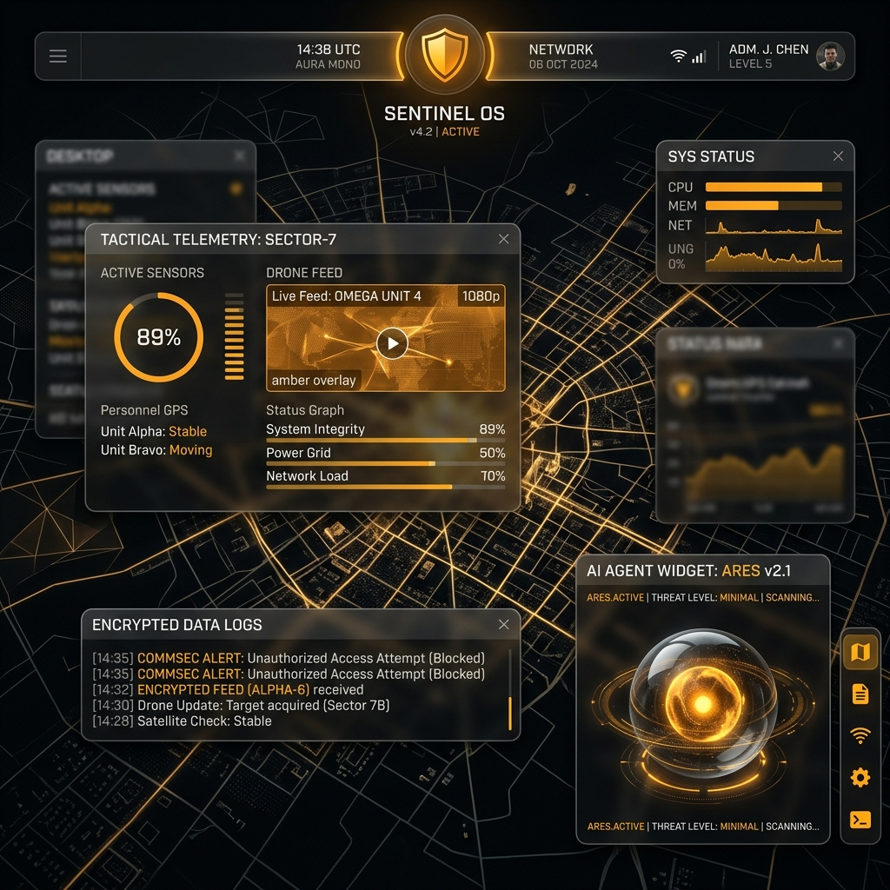
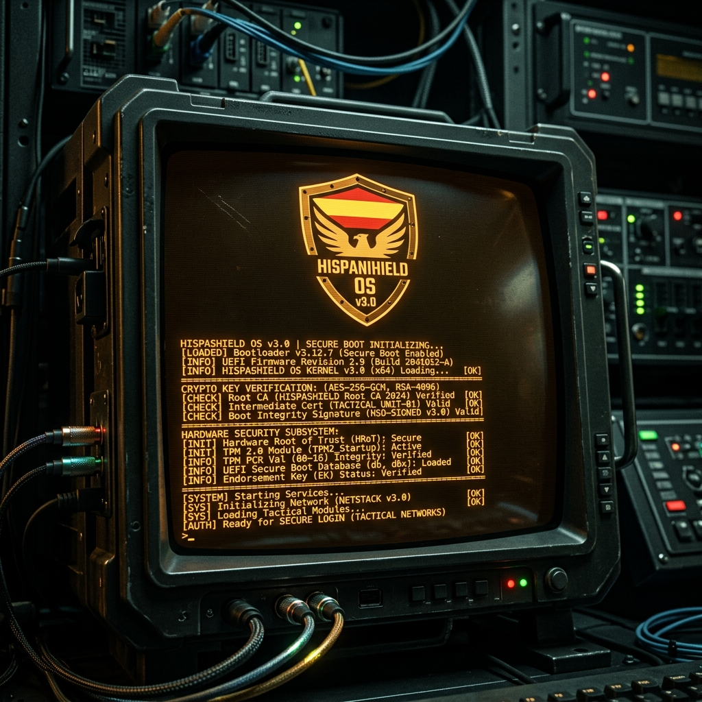
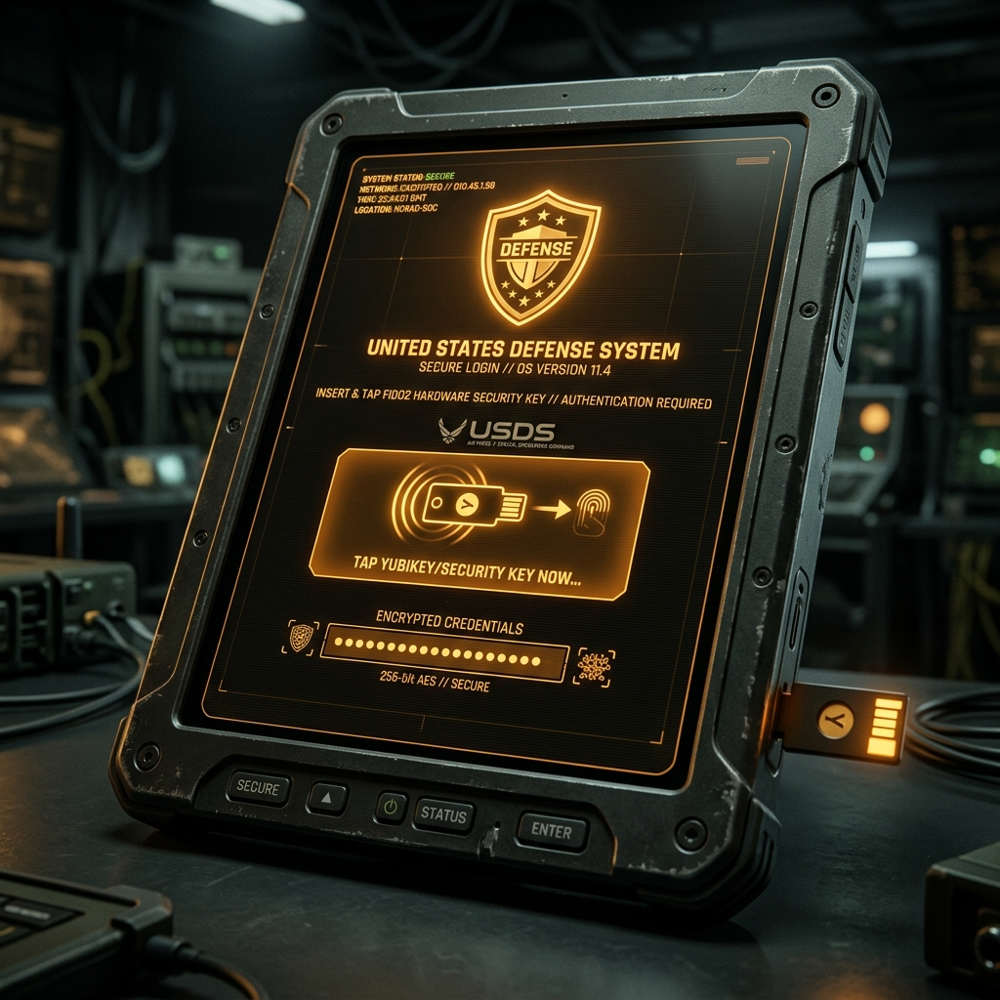
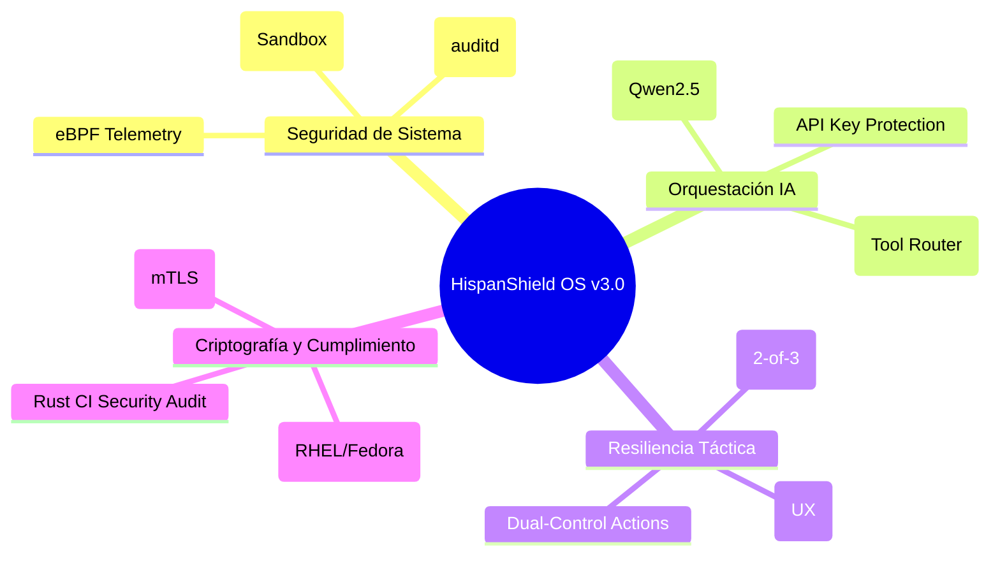

# 🛡️ HispanShield OS v3.0 (PoC / Research)
**SISTEMA OPERATIVO DE SEGURIDAD EXPERIMENTAL (CONCEPTO TÁCTICO)**

> **ESTADO**: Prueba de Concepto (PoC) / Investigación de Ciberdefensa
> **OBJETIVO**: Prototipado de arquitecturas Zero-Trust y orquestación de IA Soberana.



---

## 👁️ VISIÓN ESTRATÉGICA
HispanShield OS v3.0 es una plataforma de investigación diseñada para explorar la convergencia entre la inteligencia artificial local (Air-Gapped) y la seguridad de sistemas de nivel crítico. Este prototipo implementa una arquitectura estrictamente aislada donde cada componente está regido por políticas de confianza cero.

### 🎬 Secuencia de Arranque (Boot)
Verificación de integridad en tiempo real desde el Hardware Root of Trust.


### 🔐 Autenticación Aegis
Control de acceso robusto mediante hardware (FIDO2/U2F) con pantallas de consentimiento legal pre-login.


---

## ⚔️ CAPACIDADES NÚCLEO (v3.0 REFACTORED)

### 1. 🧬 Arquitectura Zero-Trust Inmutable
*   **Aegis Sentinel (Rust)**: Orquestador central que gestiona la telemetría del kernel eBPF y la integridad de los binarios.
*   **Políticas AppArmor**: Perfiles estrictos para el runtime del LLM y procesos críticos, minimizando la superficie de ataque.
*   **Auditoría Inmutable**: Integración con `auditd` para garantizar que cada acción sea trazable y no repudiable.

### 2. 🧠 Orquestación de IA Segura
*   **Air-Gapped LLM**: Inferencia local (llama-server) protegida mediante `--api-key` y aislamiento de red.
*   **Sanitización de Salida**: El Tool Router valida y limpia las respuestas del LLM para prevenir ataques de *Prompt Injection* y envenenamiento de logs.
*   **Interacción Táctica**: Interfaz de chat integrada con el Sentinel para consultas operativas en tiempo real.

### 3. 🛡️ Resiliencia y Mitigación
*   **Módulo Anti-Tamper**: Lógica de detección multi-sensor (2-de-3) para evitar falsos positivos destructivos.
*   **Triage de Alertas**: Panel de gestión de incidentes con priorización visual e independencia del color (glifos + patrones).
*   **Acciones Clasificadas**: Implementación de flujo "4-ojos" (dual control) para operaciones críticas del sistema.

---

## 🗺️ MAPA MENTAL DE LA ARQUITECTURA



---

## 🛠️ INSTRUCCIONES DE DESPLIEGUE (INVESTIGACIÓN)

### 1. Construcción del Ecosistema (Entorno Rust/Node)
La compilación ahora está saneada y libre de errores de dependencias.

```bash
# 1. Preparar el entorno de compilación
./final_build.sh

# 2. Compilar el Sentinel (Rust Core)
cd core/rust
cargo build --release

# 3. Compilar el Frontend (Tauri)
cd ui/aegis-desktop
npm install
npm run tauri build
```

### 2. Despliegue de Seguridad (Compliance)
```bash
# Configuración de PKI avanzada (step-ca)
sudo ./core/siem/install_siem.sh

# Configuración de niveles de seguridad MLS
sudo ./os_base/selinux/setup_mls.sh
```

---

## ⚠️ ADVERTENCIA LEGAL Y ÉTICA
Este proyecto es estrictamente una **Prueba de Concepto (PoC)**. No contiene herramientas ofensivas de uso dual ni capacidades militares reales. Su propósito es exclusivamente la investigación académica y técnica en ciberseguridad defensiva. El uso en entornos de producción o críticos bajo la falsa premisa de una certificación estatal está estrictamente prohibido.

---
**DESIGNED BY HISPANSHIELD LABS** | *Security through Architecture*
