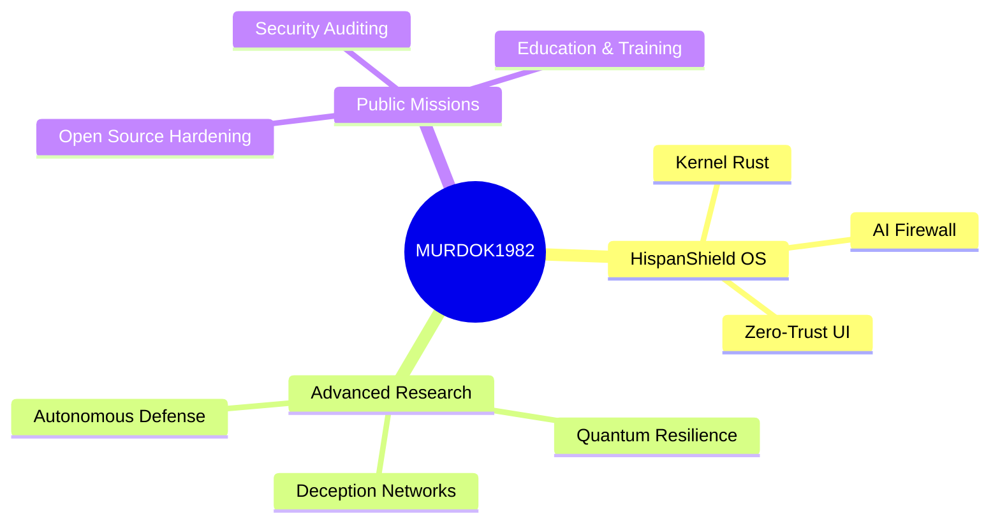

# 🛡️ COMMANDER MURDOK1982 | State Cyber-Intelligence Operative
**DIRECTOR OF SPECIAL PROJECTS @ HISPANSHIELD LABS**

---

## 👁️ OPERATIONAL VISION
Architecting the next generation of **Sovereign Cyber-Defense Infrastructure**. Specializing in Zero-Trust OS kernels, Air-Gapped AI orchestration, and Post-Quantum cryptographic protocols. My mission is the total resilience of critical state assets against Tier-1 global threats.

### 🧬 CORE SPECIALIZATIONS
*   **Tactical AI**: Designing LLM Firewalls and secure agentic workflows.
*   **Kernel Hardening**: eBPF-based telemetry and real-time anti-tamper logic.
*   **CNE / CND Architecture**: Full-spectrum cyber offensive and defensive capabilities.
*   **Military-Grade UX**: Tactical HUDs and high-pressure interface design.

---

## 🗺️ STRATEGIC INTELLIGENCE MAP

---

## ⚡ OPERATIONAL STATUS

| MODULE | STATUS | CLEARANCE |
| :--- | :--- | :--- |
| **Aegis Engine** | 🟢 ONLINE | LEVEL 5 (TS/NOFORN) |
| **PQC Infrastructure** | 🟡 RESEARCH | LEVEL 4 (SECRET) |
| **Mesh VPN Nodes** | 🟢 ACTIVE | LEVEL 3 (CONFID) |
| **Self-Destruct Logic** | 🟢 ARMED | LEVEL 5 (TS) |

---

## ⚔️ SIGNATURE PROJECTS

### [🛡️ HispanShield OS v3.0](https://github.com/murdok1982/HispanShieldOsLLmSecurity)
The pinnacle of tactical security. A military-grade operating system with integrated AI Sentinel and eBPF kernel telemetry. 
*   **Status**: PoC / Research Active.
*   **Key Tech**: Rust, Tauri, eBPF, Qwen2.5.

### [🧠 AI-Sentinel Core](https://github.com/murdok1982/HispanShieldOsLLmSecurity/tree/main/core/rust)
High-performance Rust orchestrator for secure local LLM inference.

---

## 💰 FUEL THE RESISTANCE (BITCOIN)
Support the development of sovereign security tools. Every satoshi contributes to the mission.

**BTC WALLET**: `1YourBitcoinAddressHerePleaseReplace`

---

## 📬 SECURE CHANNEL
> **ENCRYPTION**: PGP-ONLY
> **CLEARANCE**: LEVEL 3 REQUIRED
> **LOCATION**: [CLASSIFIED]

**"Security through Architecture. Victory through Intelligence."**
